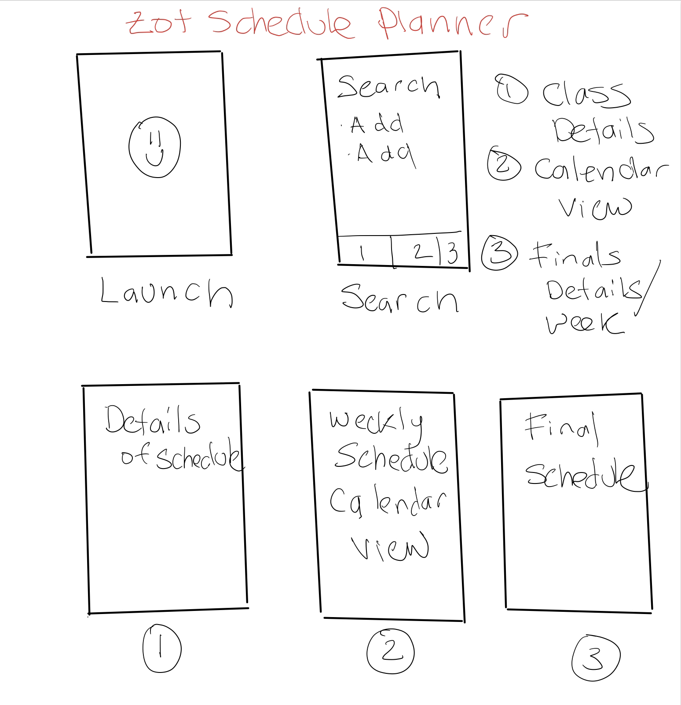
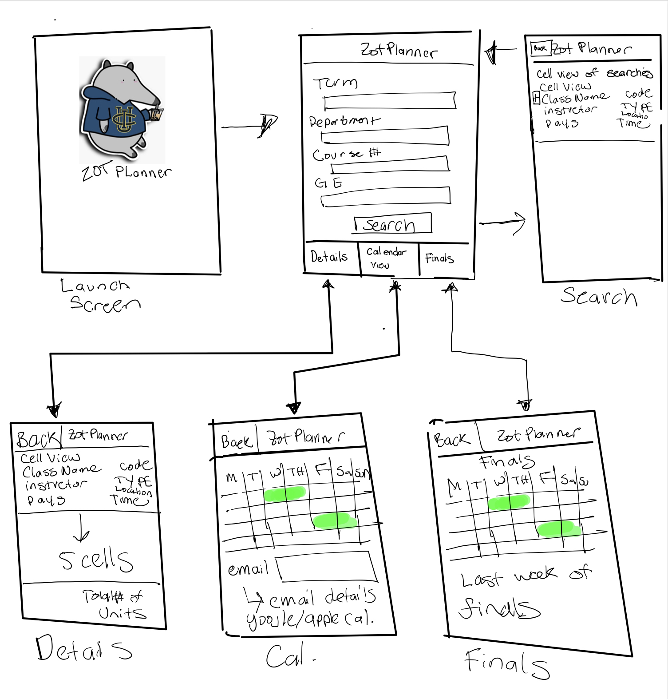

## Table of Contents
1. [Overview](#Overview)
1. [Product Spec](#Product-Spec)
1. [Wireframes](#Wireframes)
2. [Schema](#Schema)

## Overview

### Description
An application which will allow students of UCI to visualize their potential weekly schedule by interfacing with a webSOC API.

### App Evaluation
[Evaluation of your app across the following attributes]
- **Category:** Calendar / Scheduler 
- **Mobile:** IOS
- **Story:** Analyze UCI schedule
- **Market:** UCI Student Body 
- **Habit:** Quarterly Year use 
- **Scope:** 4 - 5 weeks to complete 

## Product Spec
### 1. User Stories (Required and Optional)
**Required Must-have Stories**
- [ ] Build and design a course scheduler.
- [x] Be able to fetch data from webSOC and present it to the user.
- [ ] Allow the user to add classes to a schedule.
- [ ] **Optional Nice-to-have Stories**
- [ ] Allow user to visualize schedule in calendar format.
- [ ] Persisted Calendar.
- [ ] Allow users to export calendar to iOS calendar or Google calendar.
- [ ] Display ratemyprofessor and eatervals.
### 2. Screen Archetypes
* Launch screen
  * Briefly shows on app launch, something like an anteater.
* webSOC screen
  * User can enter information to filter their search against the webSOC api.
  * Listing of courses through that filter are displayed here.
* Schedule screen
  * Schedule viewing screen, this will start as a simple list, eventually a calendar.
* Classes sceen
  * Show the number of units and what sections the user is enrolled in.
* Finals screen
  * Shows finals schedule.
### 3. Navigation
* Tab Navigation (Tab to Screen)
  * Schedule
  * Classes
  * Finals
* Flow Navigation (Screen to Screen)
  * Launch screen
  * webSOC screen
  * Class Details 
  * Calendar view
  * Finals Details/week
* Schedule screen/ Details of schedule
  * Class tab
  * Back tab (comeback to webSOC screen)
* Class screen/ weekly schedule calendar view
  * Back tab (comeback to Schedule screen)
  * Finals tab
* Finals screen/Final schedule
  * Back tab (comeback to class screen)

## Wireframes


Low Fidelity Wireframe


### [BONUS] Digital Wireframes & Mockups

### [BONUS] Interactive Prototype

## Schema 
### Models
#### Post

   | Property      | Type     | Description | Example |
   | ------------- | -------- | ------------| --------|
   | term           | String     | Which year and quarter are you looking at? | 2019 Fall |
   | GE             | String     | Return only if fulfils this GE category. | GE-2 |
   | instructorName | String     | Return only classes being taught by this professor. | Pattis |
### Networking
#### List of network requests by screen
   - Home Feed Screen
      - (Read/GET) Query webSOC api for classes matching parameters (we will need to write our own REST API service in our backend to expose the js API to our swift code):
         ```js
         // Import the module
         const WebSocAPI = require('websoc-api');

         //Specify our search parameters
         const opts = {
             term: '2019 Fall',
             GE: 'GE-2',
             instructorName: 'Pattis'
         }

         // Call the module, and when the promise resolves, print out the JSON returned
         async function start() {
             const result = await WebSocAPI.callWebSocAPI(opts);
             console.log(result.schools[0].departments[0].deptComment);
          }

         start();
         ```
#### [OPTIONAL:] Existing API Endpoints
##### API given for webSOC for use in js: https://www.npmjs.com/package/websoc-api
